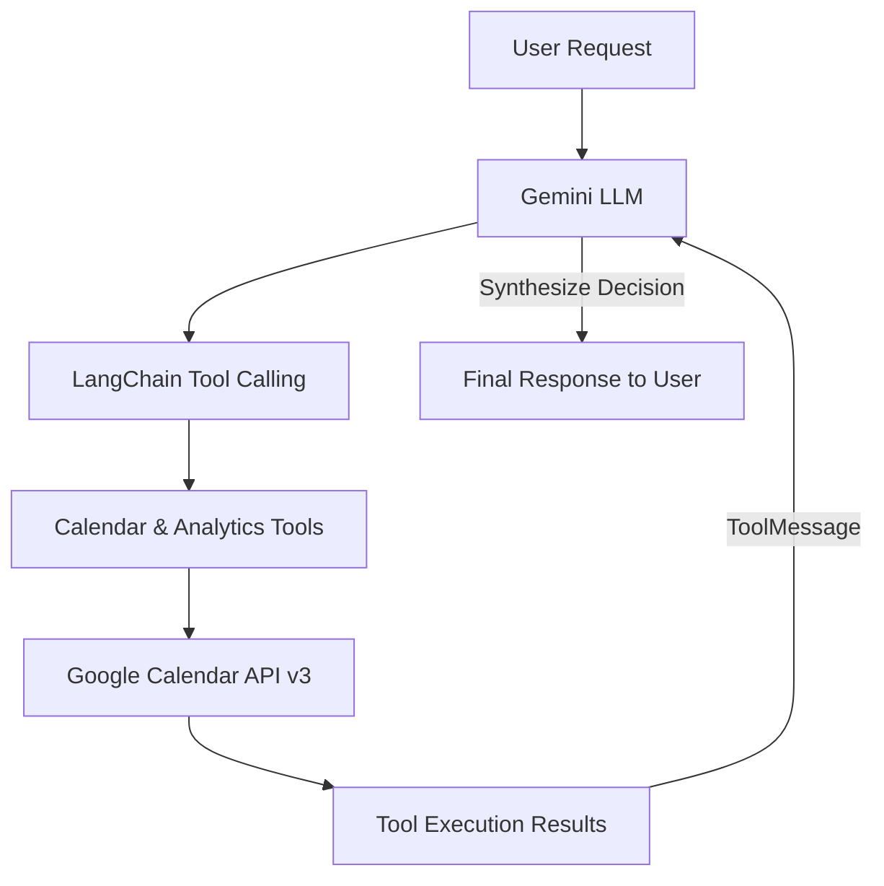
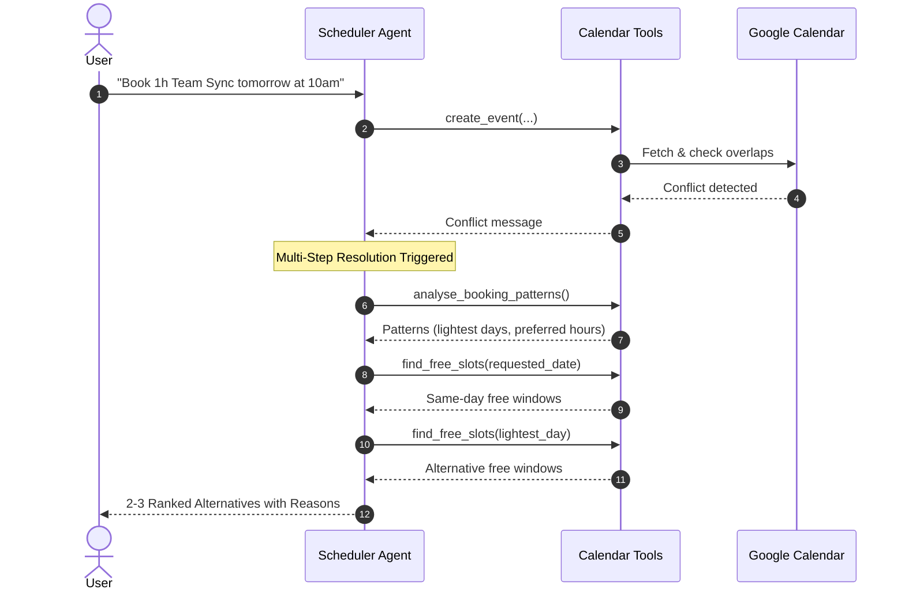

# AI-Powered Meeting Scheduler

An AI scheduling agent that converts natural-language meeting requests into Google Calendar events, detects scheduling conflicts, analyzes calendar patterns, and recommends personalized alternative time slots using LangChain and Gemini.

[](https://opensource.org/licenses/MIT)
[](https://www.python.org/downloads/)
[](https://python.langchain.com/)
[](https://ai.google.dev/)
[](https://developers.google.com/calendar)

---

## Overview

Scheduling meetings manually is a tedious, recurring distraction in professional life. People waste hours every week cross-referencing calendars, negotiating time slots, and resolving booking overlaps.

The **AI-Powered Meeting Scheduler** acts as an autonomous executive scheduling assistant. Powered by **LangChain** and Google's **Gemini** models, it bridges the gap between natural language understanding and live external calendar systems. It automatically parses dates and times, enforces past-date guards, performs mathematical interval conflict detection, inspects historical meeting habits over the past 30 days, and recommends tailored alternative slots when conflicts occur.

---

## Key Features

- 🗣️ **Natural Language Event Scheduling**: Book meetings naturally (e.g. *"Schedule a 45-min call with raj@example.com on Monday at 3pm"*).
- 🕒 **Strict Past-Date Validation**: Prevents scheduling in the past relative to the user's active timezone.
- ⚡ **Mathematical Overlap Detection**: Uses half-open interval logic ($A_{\text{start}} < B_{\text{end}} \land A_{\text{end}} > B_{\text{start}}$) to ensure zero double-bookings while cleanly allowing adjacent back-to-back meetings.
- 🔄 **Multi-Step Agent Reasoning Loop**: Uses LangChain's `ToolMessage` cycle (up to 8 iterations) to query, evaluate, and react to calendar states dynamically.
- 🔍 **Working-Hours Free Slot Detection**: Scans working hours (09:00 - 18:00) with automatic busy-interval merging and exclusion of past hours.
- 📊 **30-Day Booking Pattern Analytics**: Aggregates meeting history to identify the user's busiest days, lightest days, preferred start hours, and average durations.
- 💡 **Smart Alternative Recommendations**: When a conflict arises, proactively recommends 2–3 personalized alternative slots with explicit rationale.
- 📈 **Deterministic Calendar Intelligence**: Directly answers analytical questions such as *"Which days am I free this week?"*, *"What was my busiest day this month?"*, and *"How many hours of meetings do I have this week?"*.

---

## Architecture

The system coordinates between the LLM and the Google Calendar API through a stateful tool-calling loop:



### Smart Conflict Resolution Flow

When a requested slot is occupied, the agent triggers a multi-tool recommendation workflow:



For detailed technical design and interval mathematics, see [docs/architecture.md](docs/architecture.md).

---

## Tech Stack

| Technology | Role |
| :--- | :--- |
| **Python 3.10+** | Core programming language |
| **LangChain Core** | Agent orchestration, tool schema binding, and `ToolMessage` cycle |
| **Google Gemini (`ChatGoogleGenerativeAI`)** | LLM reasoning, intent extraction, and response synthesis |
| **Google Calendar API (v3)** | Live event creation, event queries, and calendar metadata |
| **Google Auth & OAuth 2.0** | Secure desktop authorization and local token caching |
| **Pytest & Unittest** | Comprehensive offline unit testing suite |

---

## Project Structure

```text
ai-powered-meeting-scheduler/
├── meeting_scheduler/
│   ├── __init__.py            # Package exports
│   ├── agent.py               # LangChain agent & multi-step tool execution loop
│   ├── main.py                # Command-line REPL interface
│   └── tools.py               # Pure scheduling algorithms & LangChain tools
├── tests/
│   ├── __init__.py
│   ├── test_conflicts.py      # Past-date guards, overlap mathematics, all-day events
│   ├── test_free_slots.py     # Interval merging, gap scanning, duration filtering
│   ├── test_patterns.py       # 30-day pattern analysis, frequency aggregation
│   ├── test_insights.py       # Deterministic calendar intelligence queries
│   └── test_agent_loop.py     # Multi-step ToolMessage feedback loop & limit protection
├── docs/
│   ├── architecture.md        # In-depth architectural documentation
│   └── screenshots/
│       └── Task2_Result.png   # End-to-end event verification
├── .env.example               # Environment variables template
├── .gitignore                 # Production Git ignore
├── LICENSE                    # MIT License
├── README.md                  # Project documentation
├── requirements.txt           # Minimal project dependencies
└── main.py                    # Root entry point delegating to meeting_scheduler
```

---

## Setup

### 1. Clone & Setup Virtual Environment

```bash
git clone https://github.com/Somak-2001/ai-powered-meeting-scheduler.git
cd ai-powered-meeting-scheduler

# Create virtual environment
python3 -m venv venv

# Activate virtual environment
source venv/bin/activate       # On Linux/macOS
# .\venv\Scripts\activate      # On Windows
```

### 2. Install Dependencies

```bash
pip install -r requirements.txt
```

---

## Google Cloud Setup

1. Open the [Google Cloud Console](https://console.cloud.google.com/).
2. Create a new project (e.g., `Meeting-Scheduler`).
3. Navigate to **APIs & Services** → **Library**, search for **Google Calendar API**, and click **Enable**.
4. Configure the **OAuth consent screen**:
   - Set User Type to **External**.
   - Under **Test users**, add your personal Gmail address (`your_email@gmail.com`).
5. Go to **APIs & Services** → **Credentials**:
   - Click **Create Credentials** → **OAuth 2.0 Client ID**.
   - Select **Desktop App** as the application type.
   - Click **Create** and download the resulting JSON file.
6. Rename the downloaded file to `credentials.json` and place it in the root of this project.

---

## Gemini API Setup

1. Obtain a Gemini API Key from [Google AI Studio](https://aistudio.google.com/app/apikey).
2. Copy the example environment file:
   ```bash
   cp .env.example .env
   ```
3. Open `.env` and fill in your API key:
   ```env
   GOOGLE_API_KEY=your_actual_gemini_api_key_here
   CALENDAR_ID=primary
   CALENDAR_TIME_ZONE=Asia/Kolkata
   GEMINI_MODEL=gemini-2.5-flash
   ```

---

## Environment Variables

| Variable | Required | Default | Description |
| :--- | :---: | :---: | :--- |
| `GOOGLE_API_KEY` | **Yes** | — | Gemini API key for LLM reasoning |
| `CALENDAR_ID` | No | `primary` | Target Google Calendar ID |
| `CALENDAR_TIME_ZONE` | No | `Asia/Kolkata` | Configured IANA timezone |
| `GEMINI_MODEL` | No | `gemini-2.5-flash` | Gemini model variant |
| `WORKDAY_START_HOUR`| No | `9` | Working window start hour (24-hour) |
| `WORKDAY_END_HOUR`  | No | `18` | Working window end hour (24-hour) |

---

## Usage

Start the interactive terminal scheduler:

```bash
python main.py
```

On first launch, if `token.json` is not present:
1. The app will generate an authorization URL in the terminal.
2. Open the URL in any browser, log into your Google account, and grant Calendar permissions.
3. Upon approval, `token.json` is automatically saved locally. Future runs will reuse this token.

### Example Prompts

#### 1. Direct Scheduling
```text
> Schedule a 1-hour meeting called Team Sync tomorrow at 10am
Assistant: [Agent Execution] Invoking tool: create_event({...})
Event created successfully! Link: https://calendar.google.com/event?eid=...
```

#### 2. Meeting with Attendee
```text
> Set up a 45-min call with raj@example.com on Friday at 3pm
Assistant: [Agent Execution] Invoking tool: create_event({...})
Event created successfully! Link: https://calendar.google.com/event?eid=...
```

#### 3. Handling Conflicts & Smart Suggestions
```text
> Book a 30-minute standup tomorrow at 10am
Assistant: [Agent Execution] Invoking tool: create_event(...)
[Agent Execution] Invoking tool: analyse_booking_patterns(...)
[Agent Execution] Invoking tool: find_free_slots(...)

The 10:00 AM slot tomorrow conflicts with your existing "Sprint Planning" meeting.
Based on your calendar patterns, here are 3 personalized alternatives:

1. Tomorrow at 11:00 AM – 11:30 AM
   Reason: Available open slot directly following your morning schedule.
2. Thursday at 10:00 AM – 10:30 AM
   Reason: Matches your preferred 10:00 AM start hour on your historically lightest day.
3. Tomorrow at 2:00 PM – 2:30 PM
   Reason: Available slot during your typical afternoon meeting window.
```

#### 4. Calendar Intelligence Queries
```text
> Which days am I free this week?
Assistant: Free days in this week (Sep 14 - Sep 20): Tuesday, Sep 15; Thursday, Sep 17; Friday, Sep 18.

> What was my busiest day this month?
Assistant: Busiest day in this month: Monday, 2026-09-07 with 4 meetings.

> How many hours of meetings do I have this week?
Assistant: You have 5h 30m of meetings in this week across 4 events.
```

---

## Conflict Detection

Conflict detection uses the half-open interval overlap equation:

$$\text{Conflict} \iff \text{New}_{\text{start}} < \text{Existing}_{\text{end}} \quad \land \quad \text{New}_{\text{end}} > \text{Existing}_{\text{start}}$$

This guarantees:
- Back-to-back meetings (e.g. 10:00–11:00 and 11:00–12:00) are **accepted without false positives**.
- Enclosing overlaps, contained overlaps, and partial overlaps are **reliably flagged**.
- Transparent all-day events (e.g. holidays) do **not** block timed appointments.

---

## Testing

The project includes an offline, hermetic unit test suite covering all pure scheduling algorithms and mocked tool integrations without requiring live API keys or OAuth access.

Run the test suite via `pytest`:

```bash
pytest tests/ -v
```

Or using standard library `unittest`:

```bash
python3 -m unittest discover -s tests -v
```

### Test Coverage Highlights:
- `test_conflicts.py`: Past-date validation, interval overlap math, adjacent meeting acceptance, containing/contained overlaps, all-day event safety, transparent event filtering, and cancelled event filtering.
- `test_free_slots.py`: Empty calendar handling, intermediate busy intervals, overlapping busy interval merging, duration filtering, current-day past-hour exclusion.
- `test_patterns.py`: 30-day pattern aggregation, busiest/lightest day ranking, preferred start hours, average duration calculation, empty history safety.
- `test_insights.py`: Deterministic answers for free days, busiest day, total meeting hours, empty calendar queries.
- `test_agent_loop.py`: End-to-end multi-step tool calling simulation with ToolMessage propagation, tool_call_id preservation, conflict-triggered alternative suggestion protocol, and loop iteration limit guards.

---

## Security

Security is treated as a first-class requirement:
- **Zero Committed Secrets**: `.env`, `credentials.json`, and `token.json` are excluded via `.gitignore` and have never been committed to Git history.
- **Local Credential Storage**: OAuth tokens and API secrets reside strictly on your local filesystem.
- **Minimal API Scopes**: Requests only the necessary `https://www.googleapis.com/auth/calendar` scope.
- **Input Sanitization**: Rejects invalid dates, negative durations, and protects against malformed inputs before invoking external APIs.

---

## Future Improvements

- **Interactive Rescheduling**: Direct one-click acceptance to auto-book a suggested alternative slot.
- **Multi-Calendar Sync**: Support cross-calendar availability checking across personal and work calendars.
- **Meeting Buffer Times**: Configurable 5–10 minute transition buffers between back-to-back meetings.
- **Web Interface**: Lightweight web dashboard using FastAPI and a modern UI.

---

## License

This project is licensed under the MIT License — see the [LICENSE](LICENSE) file for details.
