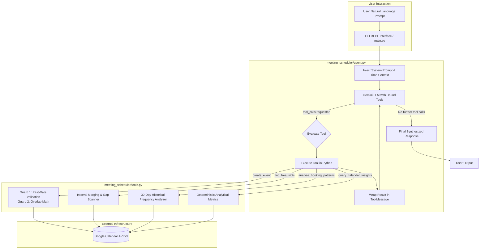
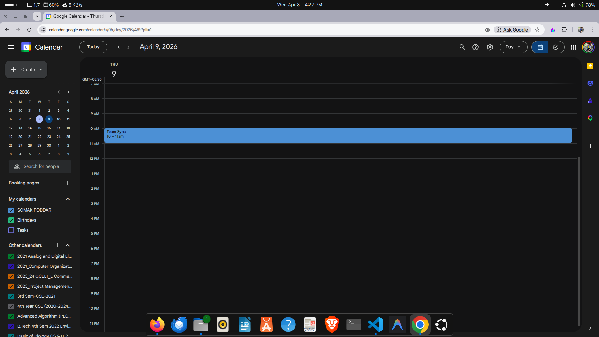

# System Architecture & Technical Design

This document details the architectural design, algorithmic foundation, and tool-calling execution cycle of the **AI-Powered Meeting Scheduler**.

---

## 1. System Overview

The AI-Powered Meeting Scheduler is an autonomous scheduling agent built on **LangChain** and Google's **Gemini** large language model, integrated with the **Google Calendar API (v3)** via **OAuth 2.0**. 

Rather than relying on naive single-shot LLM prompts, the agent implements an **iterative multi-step reasoning and tool-execution loop** governed by LangChain's `ToolMessage` protocol. This allows the system to validate inputs, detect conflicts, inspect historical habits, compute free windows, and synthesize ranked alternative slots without requiring manual user intervention.



---

## 2. Iterative Tool-Calling Execution Loop

The agent utilizes a multi-step conversation loop (supporting up to 8 reasoning iterations per request):

1. **Context Injection**: Every user turn is prepended with the exact current ISO timestamp, weekday name, and configured timezone (`Asia/Kolkata` by default).
2. **Schema-Bound Invocation**: Gemini receives the conversation history alongside the tool JSON schemas derived from LangChain's `@tool` decorators.
3. **Tool Call Interception**: If Gemini outputs `tool_calls`, the runtime parses the tool name and arguments. Missing fields (such as meeting title or duration) are assigned deterministic fallbacks (`"Meeting"`, `30` minutes).
4. **Execution & Feedback**: The Python tool function executes against local algorithms or the Google Calendar API. The output string is packaged into a `ToolMessage` with the corresponding `tool_call_id`.
5. **State Feedback**: The `ToolMessage` is appended to the message array, and Gemini is invoked again to analyze the output.
6. **Termination**: When Gemini determines that all necessary tools have executed, it synthesizes the final user-facing text and returns.

---

## 3. Algorithmic Scheduling Mechanics

### 3.1 Interval Overlap Mathematics (Conflict Detection)
Meetings in Google Calendar are modeled as half-open time intervals:
$$\text{Event } A = [A_{\text{start}}, A_{\text{end}}), \quad \text{Event } B = [B_{\text{start}}, B_{\text{end}})$$

Two events conflict if and only if:
$$A_{\text{start}} < B_{\text{end}} \quad \land \quad A_{\text{end}} > B_{\text{start}}$$

#### Boundary Behaviors:
- **Adjacent Events**: A meeting ending at 11:00 AM and another starting at 11:00 AM do **not** conflict ($11:00 < 11:00$ evaluates to `False`).
- **Partial Overlaps**: $10:00–11:00$ and $10:30–11:30$ are correctly detected as a conflict.
- **Enclosing Overlaps**: A meeting from $09:00–12:00$ overlapping a meeting from $10:00–11:00$ triggers a conflict regardless of whether the new meeting is the enclosing or enclosed event.
- **All-Day Events**: Checked for transparency (`transparent` vs. `opaque`). Transparent events (e.g., reminders) do not block scheduled meetings.

### 3.2 Free-Slot Gap Detection with Interval Merging
To compute free working-hour windows ($09:00 - 18:00$):

1. **Busy Range Extraction**: All existing events intersecting the working window are truncated to $[ \max(\text{start}, \text{window\_start}), \min(\text{end}, \text{window\_end}) ]$.
2. **Interval Merging**: Overlapping or contiguous busy blocks are merged in $\mathcal{O}(N \log N)$ time:
   ```python
   for current_start, current_end in sorted_intervals[1:]:
       last_start, last_end = merged[-1]
       if current_start <= last_end:
           merged[-1] = (last_start, max(last_end, current_end))
       else:
           merged.append((current_start, current_end))
   ```
3. **Gap Scanning**: The engine traverses gaps between consecutive merged busy intervals. Any gap $\ge \text{duration\_minutes}$ is recorded as an available slot.
4. **Current-Day Past Time Filtering**: If the target date is today, `window_start` is dynamically clamped to $\max(\text{window\_start}, \text{now})$, preventing the system from recommending slots in the past.

---

## 4. Smart Conflict Resolution & Pattern Analysis

When `create_event` detects a conflict, the system does not simply output "Slot is taken." It triggers the **Smart Alternative Suggestion Protocol**:

```mermaid
sequenceDiagram
    autonumber
    actor User
    participant Agent as Scheduler Agent
    participant Calendar as Google Calendar API
    participant Analytics as Pattern Engine

    User->>Agent: "Book a 1-hour team sync tomorrow at 10am"
    Agent->>Calendar: create_event(title="Team Sync", 10:00, 60m)
    Calendar-->>Agent: Conflict detected with "Sprint Review (10:00-11:00)"
    
    rect rgb(240, 248, 255)
        note over Agent,Analytics: Proactive Recommendation Protocol
        Agent->>Calendar: analyse_booking_patterns() (30-day window)
        Calendar-->>Agent: Patterns: Lightest days = Thursday, Friday; Preferred hr = 14:00
        Agent->>Calendar: find_free_slots(tomorrow, 60m)
        Calendar-->>Agent: Free slots: 11:00-13:00, 14:00-18:00
        Agent->>Calendar: find_free_slots(next_lightest_day, 60m)
        Calendar-->>Agent: Free slots: 09:00-12:00, 14:00-17:00
    end

    Agent-->>User: 3 Ranked Alternatives with Justifications:<br/>1. Tomorrow at 14:00 (Matches preferred afternoon hour on requested date)<br/>2. Tomorrow at 11:00 (Immediate follow-up slot on requested date)<br/>3. Thursday at 10:00 (On your historically lightest meeting day)
```

### Pattern Metrics Computed:
- **Busiest Days**: Weekdays with the highest density of timed meetings over the last 30 days.
- **Lightest Days**: Weekdays with the lowest meeting density, providing optimal candidates for rescheduling.
- **Preferred Start Hours**: Mode of start times grouped by hour.
- **Average Meeting Duration**: Mean duration of historical meetings.

---

## 5. Deterministic Calendar Intelligence

Natural-language analytics queries are answered using deterministic Python statistics rather than relying on probabilistic LLM math:
- **"Which days am I free this week?"**: Evaluates the date range between Monday and Sunday, checks daily meeting counts, and outputs completely open dates.
- **"What was my busiest day this month?"**: Aggregates meeting counts by calendar day across the active month and isolates the peak day.
- **"How many hours of meetings do I have this week?"**: Sums durations in minutes across all timed events and outputs formatted hours and minutes.

---

## 6. Verification Artifacts

The system was verified against Google Calendar API v3. Successful event creation and calendar integration were confirmed during end-to-end testing:



